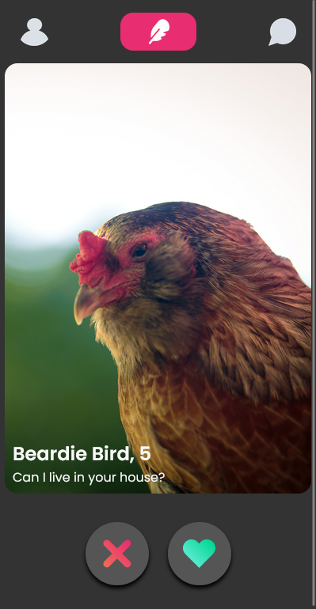
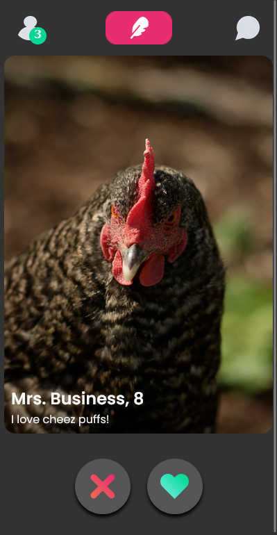
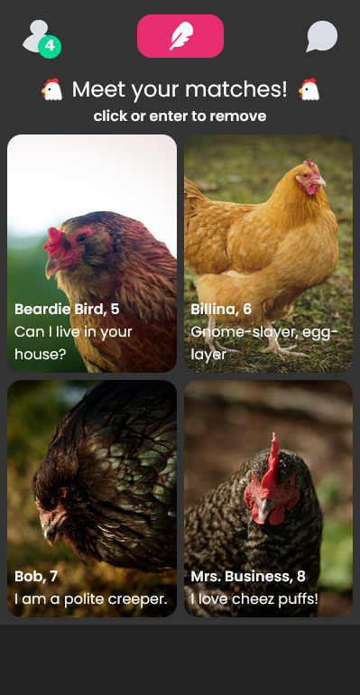

 ## Table of contents

- [Overview](#overview)
  - [The challenge](#the-challenge)
  - [Screenshot](#screenshot)
  - [Links](#links)
- [My process](#my-process)
  - [Built with](#built-with)
  - [What I learned](#what-i-learned)
  - [Continued development](#continued-development)
  - [Useful resources](#useful-resources)
- [Author](#author)
- [Acknowledgments](#acknowledgments)


### Overview

Scrimba Module 7 solo project - Tinchicken
- [Scrim](https://scrimba.com/learn/frontend/solo-project-tindog-co0e64371a0120af20b5f91e9)


### The challenge

Functionality:
- X / heart icon
- icon hover
- badge appears with click
- another dog is displayed after a pause
- has been swiped / liked sets state of app
  - swiped - clicked on any button
  - liked - clicked on heart button

Requirements:
- follow the design spec
- use JavaScript classes
- use modules (import/export)

Personal stretch goals
- personal design
- responsiveness
- save profiles
  - profile counter
  - saved profile page
  - local storage

[Figma file](https://www.figma.com/file/9jK3qWoOLowFk6XqO6t91g/Tinder-for-Dogs-(Copy)?type=design&node-id=0-1&t=XhKDy9p7DWdVW2j8-0)

### Screenshot

<h2>Application UI</h2>
<hr>



<h2>Profile counter state</h2>
<hr>



<h2>Saved profile state</h2>
<hr>




### Links

- [Scrim](https://scrimba.com/scrim/co92042e9b1c5b6d38428afea)
- [Github](https://github.com/casserole27/tinchicken)
- [Live Site](https://www.clewisdev.com/tinchicken/)

## My process

- Create Github repository
- Set up basic HTML file 
- Set up basic CSS file
- Set up basic JavaScript file
- Consult Figma design files
- Project work
- Publish live URL
- Check markup and accessibility
(https://validator.w3.org/)
(https://wave.webaim.org/)
- README file

### Built with

- CSS custom properties
- Responsive Web Design
- Accessibility and keyboard focus
- vanilla JavaScript
- JavaScript classes

### What I learned

 - Methods in constructor functions are for the instance of the class only and do not change the original data.
 - Using booleans to manipulate data
 - Disabling and reenabling buttons for better UX
 ```javascript
  heartBtn.disabled = true;
```
 - How to add keyboard focus if additional focus is needed: can use e.key or e.type
 ```javascript
 function removeImage(e) {
    const profile = e.target.dataset.saved;

    if (e.key === 'Enter' || e.type === 'click') {
        if (profile) {
            const index = likedProfiles.findIndex(item => item.name === profile)
            if (index !== -1) {
                likedProfiles.splice(index, 1);
                renderSavedProfiles(likedProfiles);
                profileCounter(likedProfiles);
            };
        };
    };

    if ((e.key === 'Enter' || e.type === 'click') && likedProfiles.length === 0) {
        resetApp();
    };
};
```


### Continued development

- [Code review](https://scrimba.com/scrim/co32142e0a72507d39689ebb0)
   - saved profiles container should be populated inside main - not sure how to do that
   - buttons too large for mobile size 
   - use the cascade, don't separate hover / focus states - components in same location
   - chickensData - array of objects, can use the name as a key inside the object
   - map through each item, item.name, link variable with data
   - consistent indentation in Classes file
   - class file - return with a container around everything?
   - group event listeners, one listener on the document - possibly better performance
   - use filter method to find hasBeenSwiped to render next chicken

- [Paul's scrim](https://scrimba.com/scrim/coe824d17b7903c07531c5b36)
    - use index variable to access original array instead of manipulating it with a .shift() method
    - don't manipulate original data, setup for React 
    ```javascript
    //use index of array rather than manipulating or changing original chickensData array
    let currentChickenIndex = 0;
    let currentChicken = new Chicken(chickensData[currentChickenIndex])
    ```

- [Amir's project change](https://www.loom.com/share/2e61c3a728cc4474b4523fc5778b6fdf?sid=2fbe7f38-b6db-4530-933e-31a7490a3594)


### Useful resources

 - [Scrimba help](https://projects.scrimba.com/tindog)

 - [Paul's notes on classes](https://stackblitz.com/edit/javascript-essentials-classes-14jun2023?file=index.js)


## Author

- Website - [C Lewis](https://www.clewisdev.com)
- LinkedIn - [LinkedIn](https://www.linkedin.com/in/clewisdev/)


## Acknowledgments

Felicity, Paul, and Amir 


